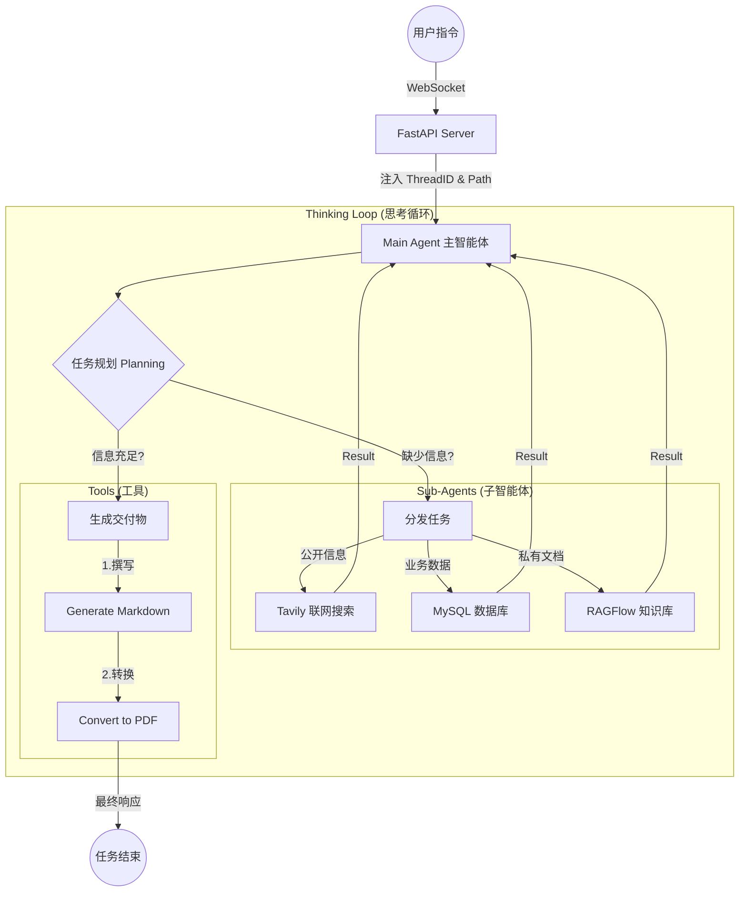

# Deep_Search_A2A

<div align="center">

**基于 DeepAgents + LangGraph 的多智能体深度搜索系统 —— 模拟高级研究员思维的信息挖掘引擎**

[](https://www.python.org/)
[](LICENSE)

主智能体统筹 · 多专家子智能体并行协作 · 搜索-阅读-反思-再搜索多轮迭代

</div>

## 🎯 项目简介

利用 DeepAgents **模拟人类高级研究员思维**的多路组合智能体系统，以「主智能体统筹 + 多专家子智能体并行协作」为核心架构，突破传统 RAG 单次检索的局限，通过**搜索 → 阅读 → 反思 → 再搜索**的多轮迭代，深度挖掘海量信息背后的隐藏逻辑，实现**广覆盖、高精准、强可靠**的复杂信息处理与文档生成。

典型应用场景（以医药行业为例）：用户只需下达自然语言指令（如"调研某类药品的市场现状并生成分析报告"），系统自动调度联网搜索、企业数据库、私有知识库三路专家并行取证，多轮迭代补充信息缺口，最终输出结构化的 Markdown / PDF 报告。

## ✨ 核心特性

| 特性 | 说明 |
|------|------|
| 🧠 多轮反思式检索 | 搜索-阅读-反思-再搜索，信息不足时自动补充检索，拒绝浅尝辄止 |
| 👔 1 主 + N 专架构 | 主智能体只做统筹规划，三个专家子智能体各司其职、并行协作 |
| 🌐 广域联网搜索 | 强制多角度检索（≥3 个角度，≤5 次上限），覆盖公开信息全维度 |
| 🗄️ 企业数据查询 | Text-to-SQL 直连业务数据库，先看表结构再预览数据后查询，防幻觉 |
| 📚 私有知识检索 | 对接 RAGFlow 企业知识库，动态发现助手、分层提问、保留原始语义 |
| 📝 文档自动生成 | Markdown 撰写 + PDF 转换，报告内容 ≥1000 字并内置 todo-list 规划 |
| ⚡ 实时进度推送 | WebSocket 全双工通信，Agent 思考过程与工具调用实时可见 |
| 🔒 会话级隔离 | ContextVars + 独立工作目录，多用户并发互不串扰 |

## 🏗️ 系统架构



## 🤖 Agent 设计

### 主智能体（Main Agent）—— "项目经理"

不直接执行搜索或查询任务，专注于**理解需求、拆解任务、调度资源、交付结果**：

- 理解用户意图，判断信息边界（公开信息 / 业务数据 / 私有知识），边界不明时三路全调
- 管理会话状态与记忆（LangGraph 有状态工作流 + 内存检查点）
- 强制工作目录约束：所有文件读写仅在系统指定的会话目录内进行
- 严格执行顺序：先取证 → 后生成，禁止用占位符内容生成文档

### 子智能体（Sub-Agents）—— 三个专家

| 专家 | 职责 | 关键策略 |
|------|------|----------|
| 🌐 **联网搜索助手** | 公开知识广域检索 | 由浅入深多轮递进，至少 3 个角度、最多 5 次检索 |
| 🗄️ **数据库查询助手** | 企业业务数据精准提取 | 三步走：表结构 → 数据预览 → 自定义 SQL，杜绝臆造表名 |
| 📚 **RAGFlow 助手** | 私有知识库深度检索 | 先动态发现助手列表 → 分层提问（先高视角后深入）→ 至少 3 个问题 → 原样传回检索信息不做概括 |

## 🧰 工具体系

### 主智能体工具

| 工具 | 功能 |
|------|------|
| `generate_markdown` | 生成标准 Markdown 文档 |
| `convert_md_to_pdf` | 将 Markdown 转换为 PDF 文件 |
| `read_file_content` | 读取上传文件（md / docx / pdf / xlsx），Excel 附带数据统计 |

### 联网搜索助手

| 工具 | 功能 |
|------|------|
| `search_online` | 基于 Tavily 的互联网公开信息多轮、多角度检索 |

### 数据库查询助手

| 工具 | 功能 |
|------|------|
| `list_sql_tables` | 列出数据库所有表结构 |
| `get_table_data` | 读取表数据预览（前 100 行，CSV 格式） |
| `execute_sql_query` | 执行自定义 SQL 查询 |

### RAGFlow 知识库助手

| 工具 | 功能 |
|------|------|
| `get_assistant_list` | 获取知识库可用助手列表及关联知识库 |
| `create_ask_delete` | 临时会话单次提问，用完即删、无数据残留 |

## 🧬 技术栈

| 层级 | 技术 | 说明 |
|------|------|------|
| 智能体框架 | LangChain · LangGraph · DeepAgents | 项目的"神经中枢"。LangGraph 构建有状态的循环工作流，让 Agent 具备记忆、规划与自我修正能力，打破传统 LLM 单次问答的限制 |
| 大模型 | OpenAI SDK（兼容接口） | 通过 bind_tools 实现 Tool Calling 函数调用 |
| 数据校验 | Pydantic | 定义 Agent 状态结构与工具输入参数模型，确保数据流转类型安全 |
| Web 框架 | FastAPI | 高性能异步 Web 框架，提供 RESTful API 与文件上传下载 |
| 实时通信 | WebSocket | 全双工通信，将 Agent 思考过程与工具执行结果实时推送前端 |
| 服务器 | Uvicorn | ASGI 服务器，FastAPI 的启动引擎 |
| 联网搜索 | Tavily Search API | 专为 AI 设计的搜索引擎，返回结构化内容（链接 + 清洗后的正文），大幅降低 Agent 的 Token 消耗 |
| 知识库 | RAGFlow | 企业级 RAG 引擎，连接私有知识库，支持文档深度解析与语义检索 |
| 数据库 | MySQL Connector · SQLAlchemy | 赋予 Agent 操作结构化数据（SQL）的能力，查询业务数据 |
| 文档处理 | Markdown · Word COM（pywin32） | Markdown 报告生成与 PDF 转换 |
| 并发隔离 | Asyncio · ContextVars | async/await 非阻塞 IO；ContextVars 在异步并发中"隐形传态"传递 thread_id 与工作目录，防止多用户数据串线 |
| 路径处理 | Pathlib | 面向对象文件路径处理，解决 Windows/Linux 分隔符差异 |

## 📡 API 一览

| 方法 | 路径 | 说明 |
|------|------|------|
| POST | `/api/task` | 提交任务，返回 `thread_id`，Agent 后台异步执行 |
| POST | `/api/upload` | 上传文件到会话工作区（多文件） |
| GET | `/api/download` | 下载输出目录下的文件（含路径越权校验） |
| GET | `/api/files` | 浏览输出目录文件列表（含路径越权校验） |
| WS | `/ws/{thread_id}` | WebSocket 实时推送（心跳 / 状态 / 会话目录） |

## 📂 目录结构

```
deep_search_A2A/
├── agent/                      # 智能体定义
│   ├── main_agent.py           # 主智能体组装与执行逻辑
│   ├── llm.py                  # 大模型初始化
│   ├── prompts.py              # 提示词加载
│   └── subagents/              # 三个专家子智能体
│       ├── search_online_agent.py    # 联网搜索助手
│       ├── database_query_agent.py   # 数据库查询助手
│       └── knowledge_base_agent.py   # RAGFlow 助手
├── api/                        # FastAPI 服务层
│   ├── server.py               # 服务入口（端口 8200）
│   ├── context.py              # ContextVars 会话隔离
│   └── monitor.py              # WebSocket 监控单例
├── tools/                      # 工具库
│   ├── tavily_tool.py          # 联网搜索工具
│   ├── sql_tools.py            # 数据库工具
│   ├── ragflow_tools.py        # 知识库工具
│   ├── markdown_tools.py       # Markdown 生成
│   ├── pdf_tools.py            # MD 转 PDF
│   └── upload_file_read_tool.py # 上传文件读取
├── utils/
│   ├── path_utils.py           # 路径清洗与会话隔离
│   └── word_converter.py       # Word COM 引擎 PDF 转换
├── ragflow/                    # RAGFlow 对接与演示脚本
├── prompt/prompts.yml          # 全部提示词配置
├── UI/                         # Vue 3 + TypeScript 前端
├── output/                     # 会话产物目录（运行时生成，不入库）
├── updated/                    # 上传文件暂存区（运行时生成，不入库）
├── requirements.txt            # Python 依赖
└── .env.example                # 环境变量模板
```

## 🚀 快速开始

### 前置条件

- Python 3.12+
- Node.js 18+
- MySQL 数据库
- RAGFlow 服务
- LLM API Key
- Tavily API Key

### 1. 安装后端依赖

```bash
git clone <https://github.com/Gweih/deep_search_A2A.git>
cd deep_search_A2A

python -m venv .venv
pip install -r requirements.txt
```

### 2. 配置环境变量

```bash
cp .env.example .env
```

编辑 `.env` 填入真实配置：

| 变量 | 说明 |
|------|------|
| `OPENAI_BASE_URL` / `OPENAI_API_KEY` | LLM 服务地址与密钥（⚠️ 不要提交到 git） |
| `LLM_QWEN_PLUS` 等 | 模型名称（当前默认加载 `LLM_QWEN_PLUS`） |
| `TAVILY_API_KEY` | Tavily 联网搜索密钥 |
| `MYSQL_USER` / `MYSQL_PASSWORD` / `MYSQL_DATABASE` / `MYSQL_HOST` / `MYSQL_PORT` | 数据库连接信息 |
| `RAGFLOW_API_URL` / `RAGFLOW_API_KEY` | RAGFlow 服务地址与密钥 |

### 3. 启动后端

```bash
python -m api.server
```

服务运行在 `http://localhost:8200`，WebSocket 地址为 `ws://localhost:8200/ws/{thread_id}`。

### 4. 启动前端

```bash
cd UI
npm install
npm run dev
```

按终端提示在浏览器打开前端页面。

### 5. 本地快速测试（无需前端）

在 `agent/main_agent.py` 末尾的测试入口修改任务描述后直接运行：

```bash
python -m agent.main_agent
```

## ⚠️ 注意事项

- 所有 API Key 与数据库密码均为个人密钥，请勿提交到版本库或分享给他人
- `output/` 与 `updated/` 为运行时生成的会话目录，不会进入版本库
- 数据库查询工具默认只做检索用途，请勿对生产库执行修改类 SQL
- 本项目仅供学习交流使用

## 📄 许可证

[MIT](LICENSE) © 2026 【你的名字】